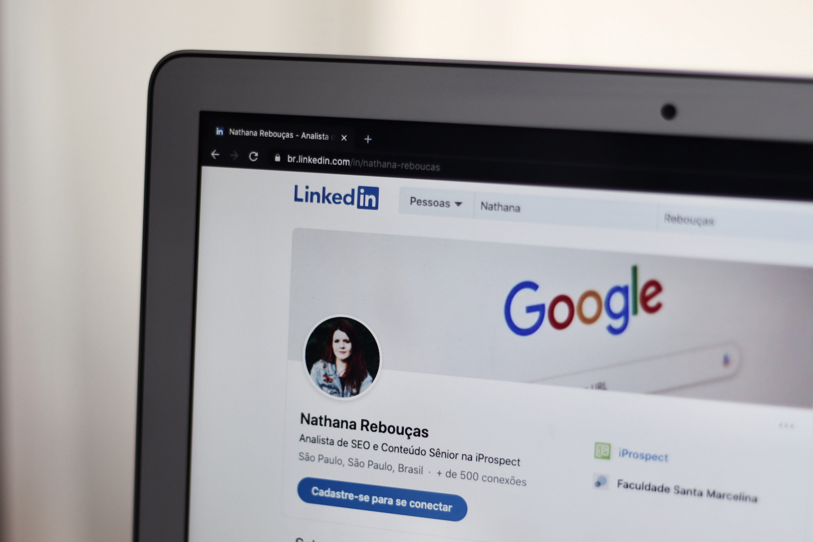

# <h1 style="color: lightblue" align="center">LinkedIn </h1>

> *
"LinkedIn is not about who you know; it's about who knows you."
*
>        &nbsp; &nbsp; &nbsp; &nbsp; &nbsp;  &nbsp; &nbsp; &nbsp; &nbsp; &nbsp; &nbsp; &nbsp; &nbsp; -- Mark W. Schaefer, Marketing Consultant and Author

 

## Overview

[LinkedIn](https://www.linkedin.com) is a business and employment-focused social media platform that works through websites and mobile apps. It launched on May 5, 2003. It is now owned by Microsoft. The platform is primarily used for professional networking and career development, and allows jobseekers to post their CVs and employers to post jobs. From 2015 most of the company's revenue came from selling access to information about its members to recruiters and sales professionals. Since December 2016, it has been a wholly owned subsidiary of Microsoft. As of March 2023, LinkedIn has more than 900 million registered members from over 200 countries and territories.

LinkedIn allows members (both workers and employers) to create profiles and connect with each other in an online social network which may represent real-world professional relationships. Members can invite anyone (whether an existing member or not) to become a connection. LinkedIn can also be used to organize offline events, join groups, write articles, publish job postings, post photos and videos, and more.

## Features

LinkedIn as a social Application offers many features such as: 

| Features                     | Description                                                                                                       |
| --------------------------- | ----------------------------------------------------------------------------------------------------------------- |
| Profile                     | Create a professional profile highlighting your skills, experiences, education, and achievements.                  |
| Connections                 | Build a network of professional connections, including colleagues, industry peers, and potential employers.       |
| Job Search                  | Explore job opportunities, search for specific roles, and apply directly through the platform.                     |
| Recommendations            | Request and provide recommendations from your connections to enhance your professional credibility.               |
| Groups                      | Join industry-specific or interest-based groups to network, share insights, and engage in discussions.             |
| Content Sharing             | Share articles, posts, and updates to showcase your expertise, stay informed, and engage with your

## Usage

 

### Personal Branding 

LinkedIn allows professionals to build exposure for their personal brand within the site itself as well as in the World Wide Web as a whole. With a tool that LinkedIn dubs a Profile Strength Meter, the site encourages users to offer enough information in their profile to optimize visibility by search engines. It can strengthen a user's LinkedIn presence if he or she belongs to professional groups in the site. The site enables users to add video to their profiles.

### Job seeking 

LinkedIn is widely used by job seekers and employers. According to [Jack Meyer](https://en.wikipedia.org/wiki/Jack_Meyer) the site has become the "premier digital platform" for professionals to network online. In Australia, which has approximately twelve million working professionals, ten million of them are on LinkedIn, according to Anastasia Santoreneos, suggesting that the probability was high that one's "future employer is probably on the site." According to one estimate based on worldwide figures, 122 million users got job interviews via LinkedIn and 35 million were hired by a LinkedIn online connection.

### Advertising

LinkedIn launched its carousel ads feature in 2018, making it the newest addition to the platform’s advertising options. With carousel ads, businesses can showcase their products or services through a series of swipeable cards, each with its unique image, headline, and description. They can be used for a variety of marketing objectives, such as promoting a new product launch, driving website traffic, generating leads, or building brand awareness.

## Conclusion

In conclusion, LinkedIn is a prominent professional networking platform that facilitates connections and interactions among individuals, businesses, and organizations. It serves as a virtual hub for professionals to showcase their work experience, skills, and accomplishments through detailed profiles. LinkedIn offers various features, including job search functionalities, content sharing capabilities, group discussions, and learning resources.

 

 

